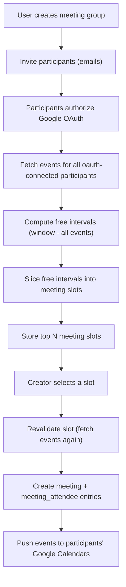

# API docs

```mermaid
flowchart TD
    A["User creates meeting group"] --> B["Invite participants (emails)"]
    B --> C["Participants authorize Google OAuth"]
    C --> D["Fetch events for all oauth-connected participants"]
    D --> E["Compute free intervals (window - all events)"]
    E --> F["Slice free intervals into meeting slots"]
    F --> G["Store top N meeting slots"]
    G --> H["Creator selects a slot"]
    H --> I["Revalidate slot (fetch events again)"]
    I --> J["Create meeting + meeting_attendee entries"]
    J --> K["Push events to participants' Google Calendars"]
```
